# Обновление 2.1.0

  

  

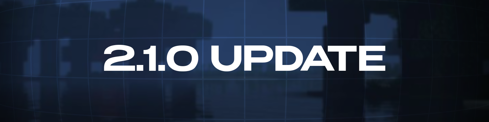

  

  

## Что нового

Добавлено множество новых функций, исправлены ошибки и улучшена стабильность.

# Добавлено

## - Добавлено отображение иконок сборок.

- Лаунчер наконец научился отображать иконки сборок! Теперь каждая сборка отличается!
  
## - Добавлен выбор версии загрузчика при создании сборки

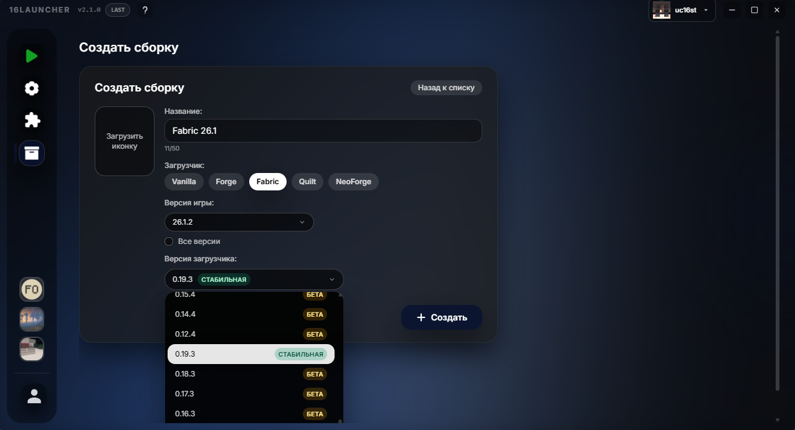

- Теперь пользователь может выбирать нужную ему версию загрузчика при создании сборки. У каждой версии есть свой бейдж, отображающий её статус: «Бета» или «Стабильная».

## - Добавлено приветствие для новых пользователей

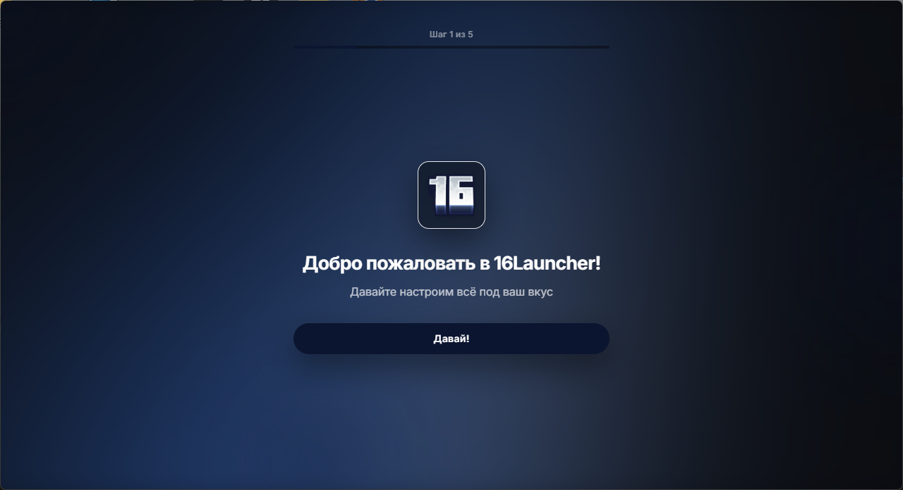

- При первом запуске лаунчера пользователя будет встречать приветственная настройка, в которой он может выбрать язык, а также войти в аккаунты. В будущем настроек будет больше.

## - Добавлена возможность загрузки GIF на задний фон

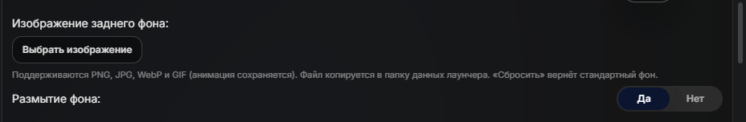

- Теперь пользователь может загружать GIF в качестве заднего фона. Анимация при этом сохраняется. К GIF также можно применять размытие.

## - Добавлено отображение скинов в лаунчере

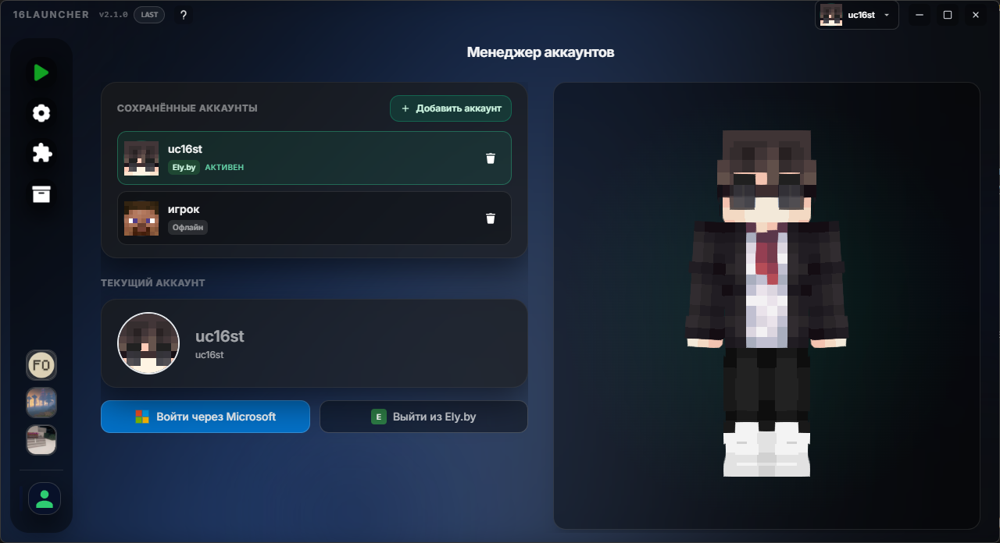

- Отображение головы скина добавлено в лаунчер в качестве "аватара".

## - Добавлен двухпанельный режим вкладок (Split Screen)

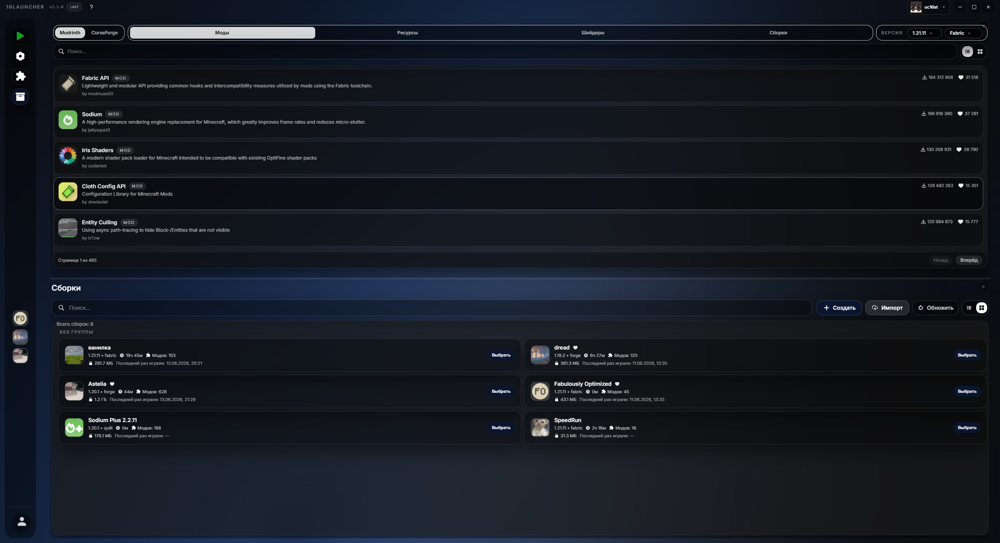

- Включив параметр "Двухпанельный режим вкладок" в настройках (Настройки -> Лаунчер -> Двухпанельный режим вкладок), пользователь может перетащить иконку любой вкладки из боковой панели в предлагаемую лаунчером область окна, после чего вкладка разделит экран на 2 части. Значительно упрощает работу в программе.

## - Добавлена возможность загрузки своих версий

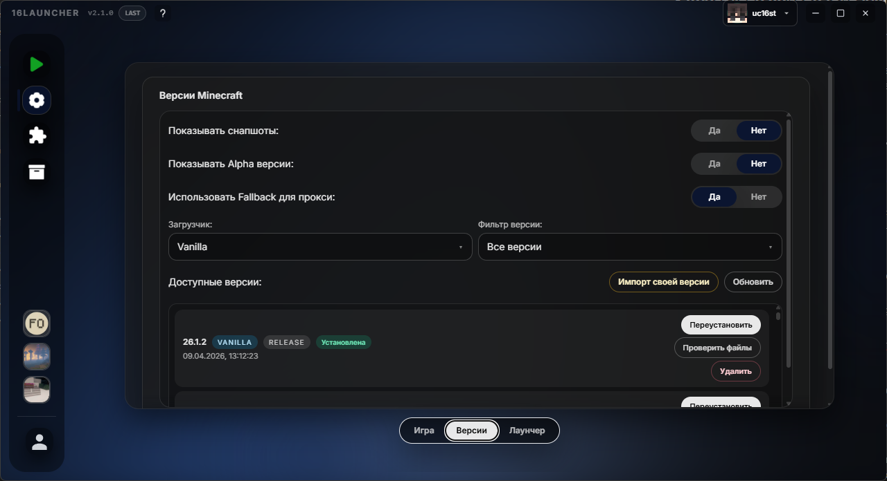

- В настройках появился новый пункт "Импорт своей версии". При нажатии на кнопку, откроется диалоговое окно с выбором файлов версии. После выбора, версия появится в списке доступных и доступна к запуску.

## - Добавлен менеджер скриншотов (совместно с https://t.me/Losash_Smeshariki, идея: https://t.me/poggys)

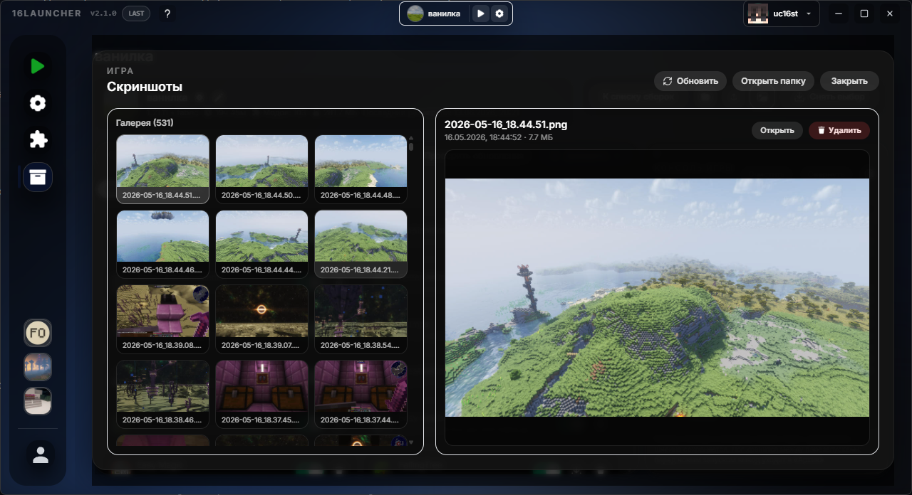

- Перейдя в управление сборкой, в правом верхнем углу пользователь может найти кнопку с иконкой изображения, нажав на которую, пользователь откроет окно со всеми скриншотами сборки.

## - Добавлена возможность закрепления сборок в боковую панель

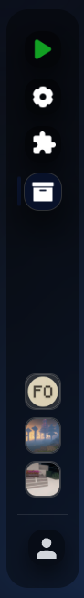

- ПКМ по карточке сборки открывает контекстное меню, в котором пользователь может выбрать пункт "Закрепить в сайдбаре". После закрепления, профиль появится в сайдбаре. Нажатие на сборку запускает её. ПКМ по закрепленному профилу открывает контекстное меню. Максимум можно закрепить 3 сборки. Делает запуск игры быстрее и удобнее.

## - Добавлены горячие клавиши

- Добавлено 4 горячие клавиши для упрощения контроля над лаунчером: `ctrl + i` - импорт сборки, `ctrl + n` - создание сборки, `ctrl + shift + d` - открепление консоли, `ctrl + shift + c` - копирование вывода консоли в буфер обмена. *Хоткеи, связанные со сборками, работают только во вкладке профилей.*

## - Добавлено авто-скачивание зависимостей для контента в сборке

- При установке мода с зависимостями, лаунчер будет автоматически проверять наличие зависимостей и автоматически скачивать их, если не находит их. Работает как с **Modrinth**, так и с **CurseForge**.

## - Добавлена возможность изменения положения боковой панели

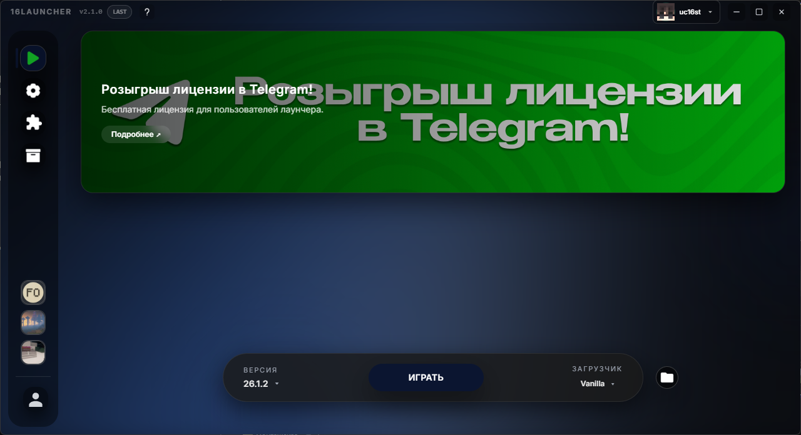
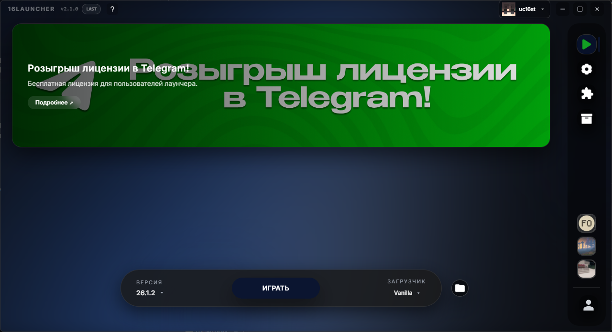
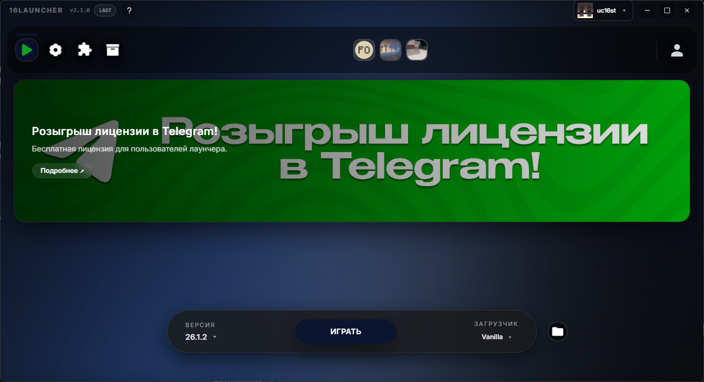
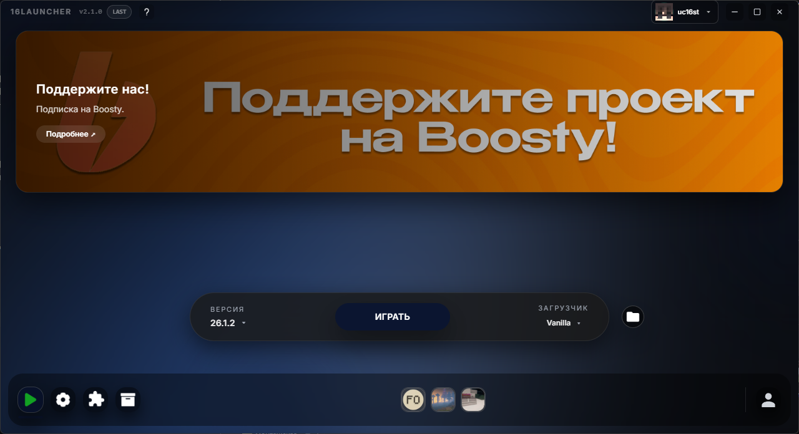

- Теперь в настройках можно выбрать положение боковой панели. Для любителей кастомизации!

## - Добавлена возможность обновления контента в сборке (идея: https://t.me/fyIBxSEQXphm)

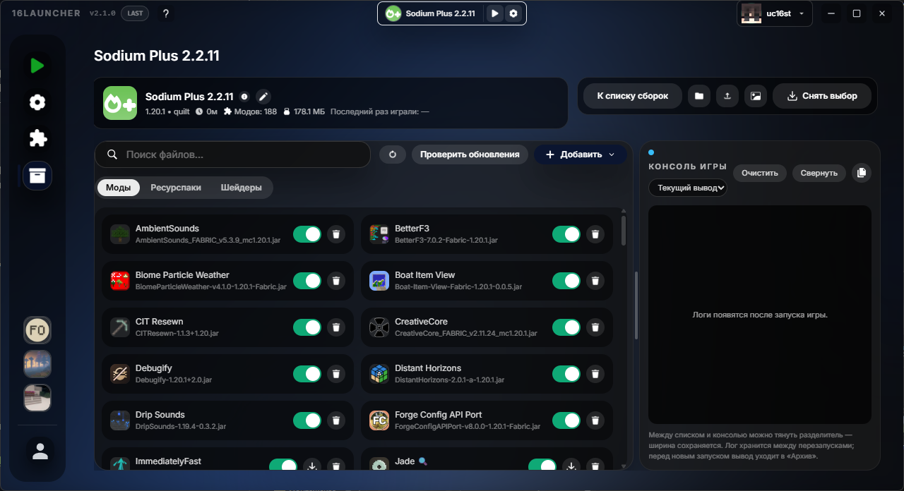
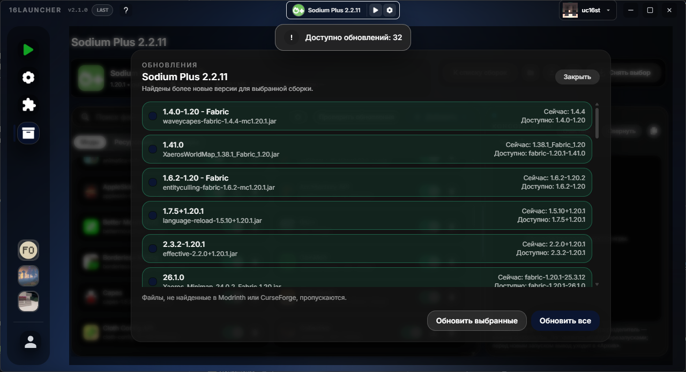

- В окне управления сборкой появилась кнопка «Проверить обновления». При нажатии лаунчер начинает проверку всего контента профиля на наличие обновлений. После завершения проверки откроется окно со списком доступных обновлений, где можно выбрать, какие файлы нужно обновить, а какие оставить на текущей версии. Также у файлов, для которых доступно обновление, появится иконка обновления. Функция работает как с CurseForge, так и с Modrinth.

## - Добавлена возможность подробного просмотра информации о сборке

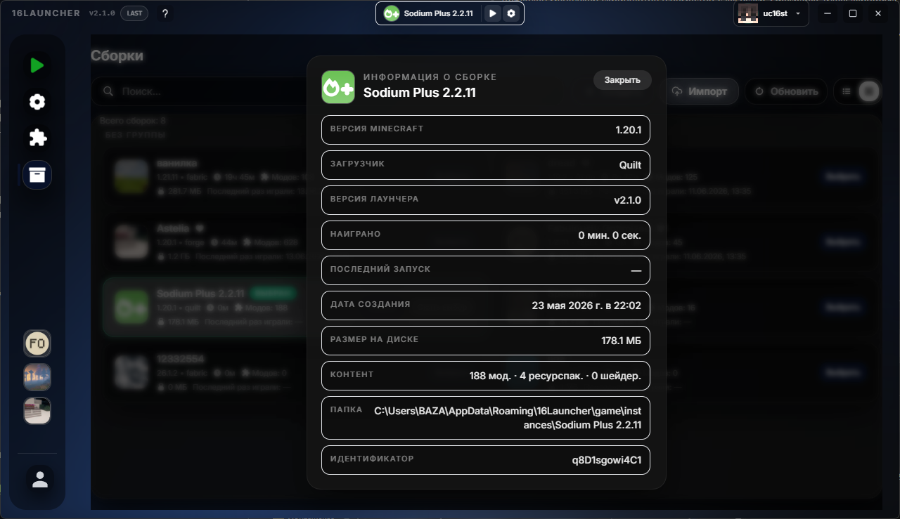

- В контекстном меню, открывающемся ПКМ по карточке, появился пункт "Информация о сборке". При нажатии открывается окошко с подробной информацией о сборке. Также доступно в окне управления.

## - Добавлено создание групп сборок

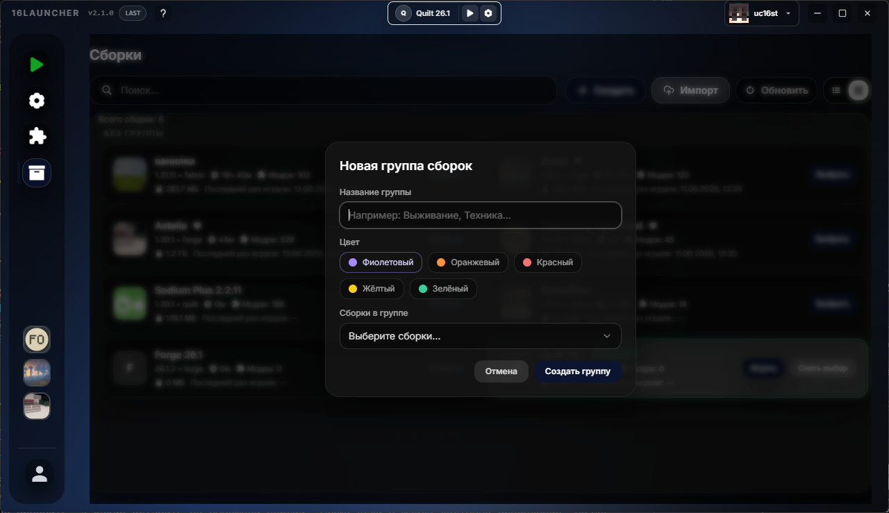
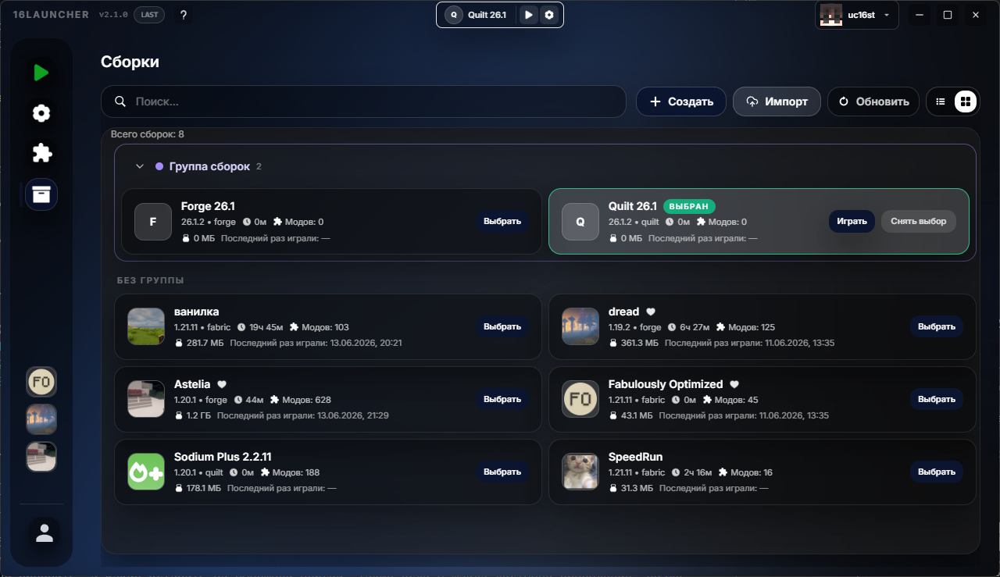

- Щелчок правой кнопкой мыши по свободному месту во вкладке со сборками вызывает контекстное меню, в котором есть пункт "Новая группа сборок". При нажатии откроется окно с заполнением данных о группе. Помогает сохранять порядок среди профилей!

## - Добавлен вынос консоли в отдельное окно

- Открепление консоли теперь выносит консоль в отдельное окно.

## - Добавлено время последнего запуска сборки

- Отображение последнего запуска сборки на карточке профиля.

## - Добавлены испанский и немецкий языки

- Чтобы им было комфортнее.

## - Добавлен 3D-просмотр персонажа

- Во вкладку с аккаунтами был добавлен 3D-просмотр персонажа с пользовательским скином. Теперь можно любоваться не только в игре.

## - Добавлена поддержка запуска игры через IPv6

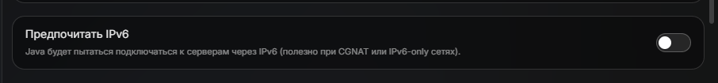

- Настройку можно найти по пути: `Настройки → Игра → Java → Предпочитать IPv6`.

# Улучшено

### - Улучшение интерфейса
### - Улучшена вкладка модов
### - Улучшен вывод консоли

# Исправлено

### - Исправлено отображение иконок сборок
### - Исправлена ошибка, из-за которой установка полностью прерывалась при постановке на паузу
### - Исправлены ошибки установки Forge (совместно с https://t.me/trassert)
### - Исправлены ошибки Linux (совместно с https://t.me/trassert)
### - Исправлены баги

Всем большое спасибо за ожидания и за поддержку!
Нашли баг? Сообщите об этом в нашем [Discord](https://discord.gg/55Y95EfsHM) или откройте issue на [GitHub](https://github.com/launcherdev11)!
