# Обновление 3.0.0

  

  

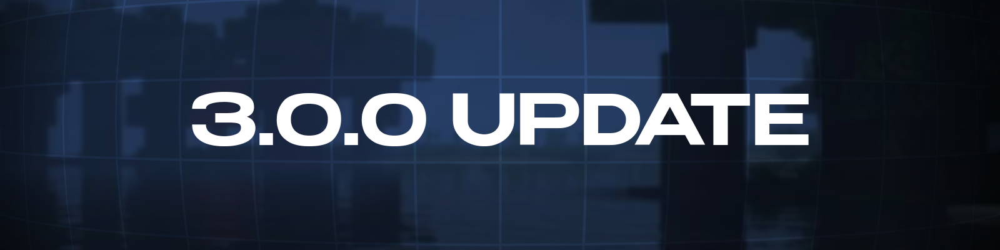

  

  

## Что нового

Добавлена собственная система аккаунтов, создание комнат для игры с друзьями, улучшение UI, оптимизация и много нового!

# Добавлено

## - Система аккаунтов

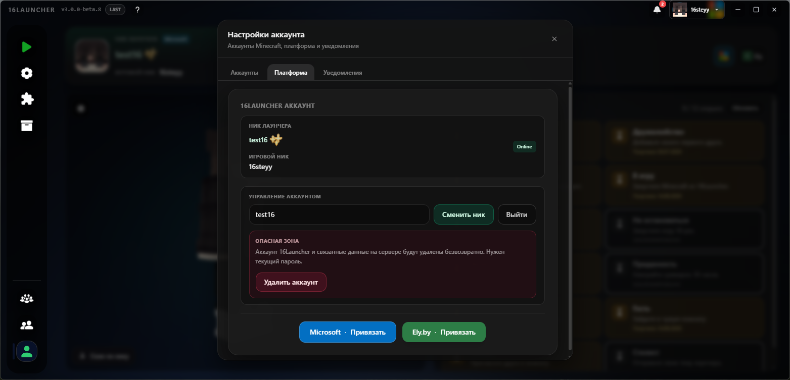

- У лаунчера появилась своя система аккаунтов! Создайте свой профиль в **16Launcher**, чтобы открыть новые возможности и функции приложения.

## - Друзья

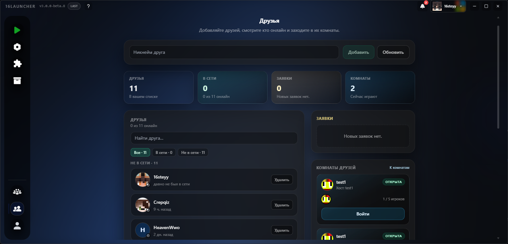

- С появлением аккаунтов вы теперь можете **добавлять других пользователей в друзья**! Мы добавили отдельную вкладку, где удобно искать игроков, отправлять запросы и управлять списком друзей.

## - Игровые комнаты

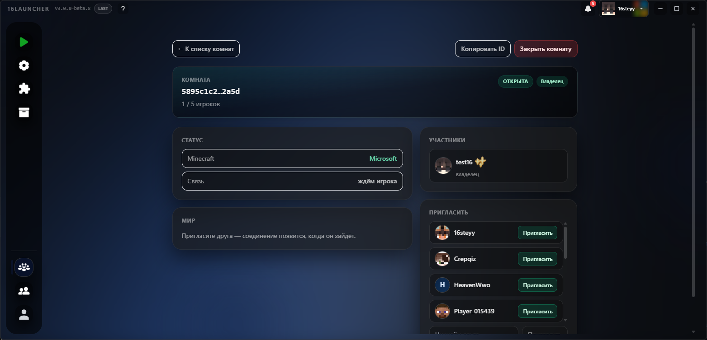

- Добавляйте друзей и объединяйтесь в игровые комнаты до 5 человек для совместной игры без сторонних программ! Перейдите во вкладку «Комнаты», создайте свою комнату, пригласите друзей и запускайте мир!

## - Достижения

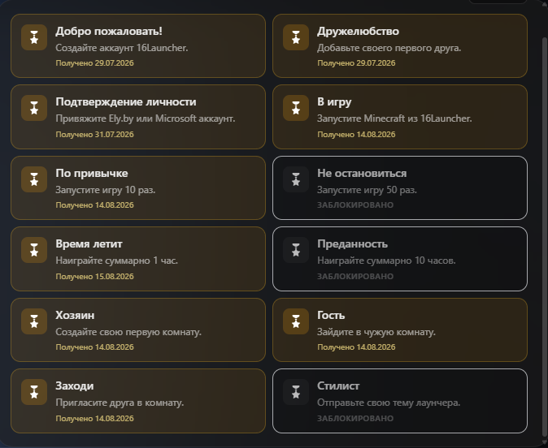

- В лаунчере появились кастомные достижения! Выполняя их, к сожалению, пока что, вы ничего не получаете :(

## - Кастомные темы

- Добавлена система кастомных тем. Пользователи могут создавать свои темы, используя `.css` в папке темы. Вы также можете выложить или скачать тему из нового раздела на нашем [сайте](https://16-launcher.ru/themes). (Идея: **RED mGe** - https://t.me/Little_chud)

## - Вкладка аккаунтов

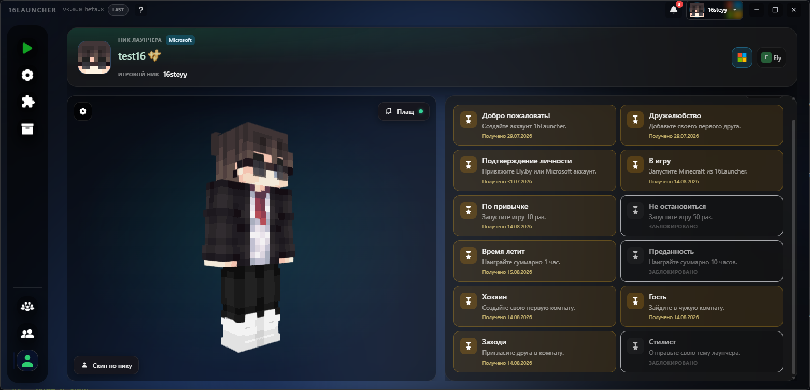

- В обновлённой вкладке появилось больше взаимодействия с профилем:
  1. **Привязка платформ:** Привязывайте сторонние аккаунты (Ely.by, Microsoft) к вашему профилю лаунчера, чтобы сохранять их при последующих входах.
  2. **Просмотр достижений:** Отслеживайте уже полученные ачивки.
  3. **Уведомления:** Центр уведомлений для платформенного аккаунта.
  4. **Обновлённый GUI:** Полная переработка вкладки и добавление новых настроек.

## - Плащ и скин

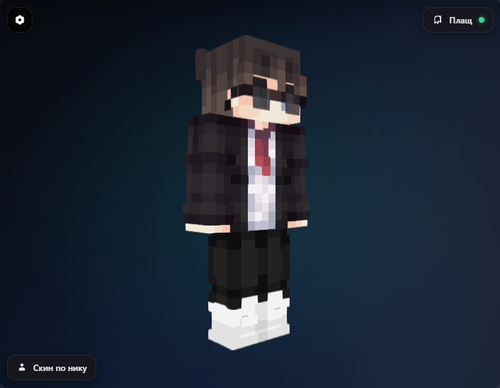

- Во вкладку аккаунтов добавлена смена плаща и скина. Лаунчер собирает информацию о плащах с вашего Microsoft-аккаунта и выводит список, чтобы вы могли легко переключаться между ними. Также вы можете сменить скин, просто введя ник любого пользователя в специальное поле.

## - Автозапуск и скрытие

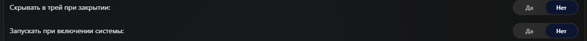

- В настройках появились новые пункты: **Скрывать в трей при закрытии** и **Запускать при включении системы**.
  - *Как включить:* `Настройки` $\rightarrow$ `Лаунчер` $\rightarrow$ `Скрывать в трей` / `Запускать при включении`.

## - Вкладка модов

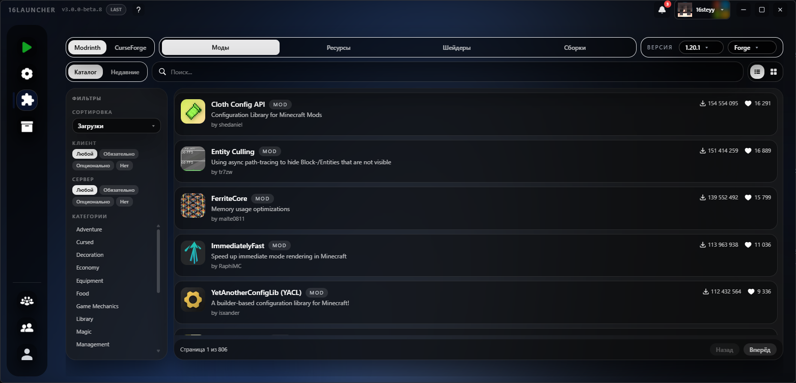

- Вкладка модов получила масштабное обновление! Добавлены удобные фильтры для Modrinth и CurseForge, а также функция **недавно просмотренного контента** — лаунчер запоминает просмотренные моды и выносит их в отдельную категорию.

## - Поиск настроек

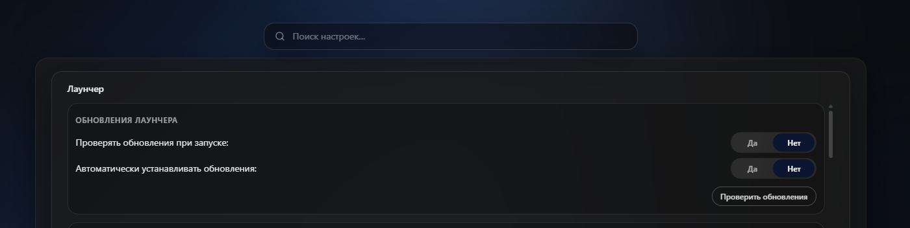

- Во вкладке настроек появился быстрый поиск по ключевым словам.

## - Уведомления

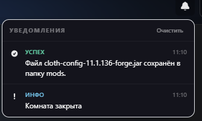

- Добавлено сохранение системных уведомлений лаунчера с возможностью их повторного просмотра.

## - Изменение положения ресурс-паков.

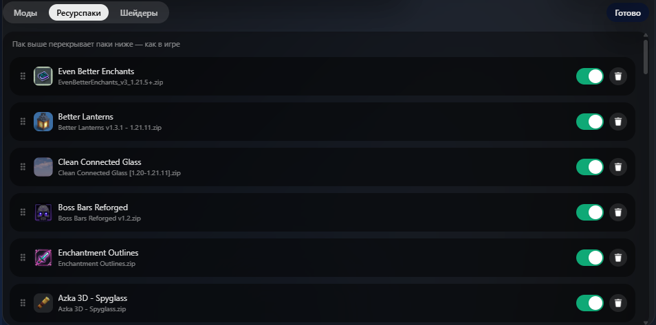

- В меню управления сборкой теперь можно менять приоритет и положение ресурс-паков, не заходя в игру!

## - Выбор активного шейдера.

- В управлении сборкой появилась возможность переключать активный шейдер прямо из лаунчера.

# Улучшено

### - Улучшение интерфейса
### - Улучшение оптимазции
### - Отображение некоторых элементов

# Исправлено

### - Исправление экспорта сборок
### - Исправление приветствия новых пользователей
### - Исправление незначительных багов

Друзья, на создание этого обновления ушло огромное количество времени (разработка началась ещё в марте!) и ресурсов. Спасибо всем за поддержку и помощь! 

Отдельная благодарность нашей команде тестировщиков, которые помогали отлавливать ошибки, чтобы вы получили стабильный продукт: **Crepqiz**, **Player_015439**, **RED mGe**, **Telona Hyuga GP**, **ВейВв**.

Если вы хотите поддержать проект и помочь его дальнейшему развитию, вы можете стать [нашим бустером на Boosty](https://boosty.to/16steyy)! Для бустеров предусмотрена награда в виде эксклюзивного бейджа **«Спонсор»** в лаунчере и благодарность в списках обновлений!

Нашли баг? Сообщите об этом в нашем [Discord](https://discord.gg/55Y95EfsHM) или откройте issue на [GitHub](https://github.com/launcherdev11)!
