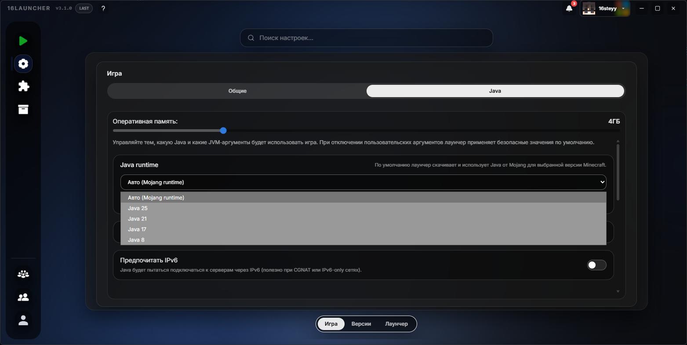

# Обновление 3.1.0

  

  

  

  

## Что нового

Добавлена возможность выбора версии Java Runtime.

# Добавлено

## - Выбор версии Runtime.

- В настройках теперь можно выбрать конкретную версию runtime, как глобально, так и для каждой сборки отдельно. Найти параметр: `Настройки` $\rightarrow$ `Игра` $\rightarrow$ `Java` $\rightarrow$ `Java runtime`.

Если вы хотите поддержать проект и помочь его дальнейшему развитию, вы можете стать [нашим бустером на Boosty](https://boosty.to/16steyy)! Для бустеров предусмотрена награда в виде эксклюзивного бейджа **«Спонсор»** в лаунчере и благодарность в списках обновлений!

Нашли баг? Сообщите об этом в нашем [Discord](https://discord.gg/55Y95EfsHM) или откройте issue на [GitHub](https://github.com/launcherdev11)!
