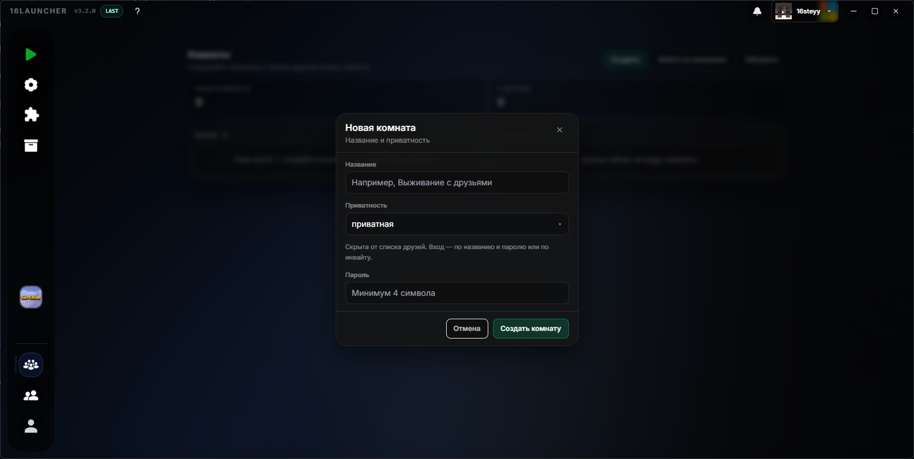
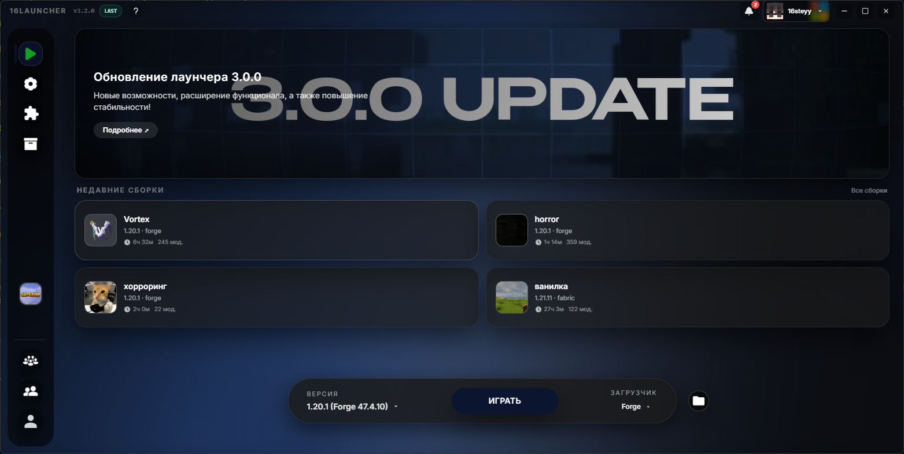
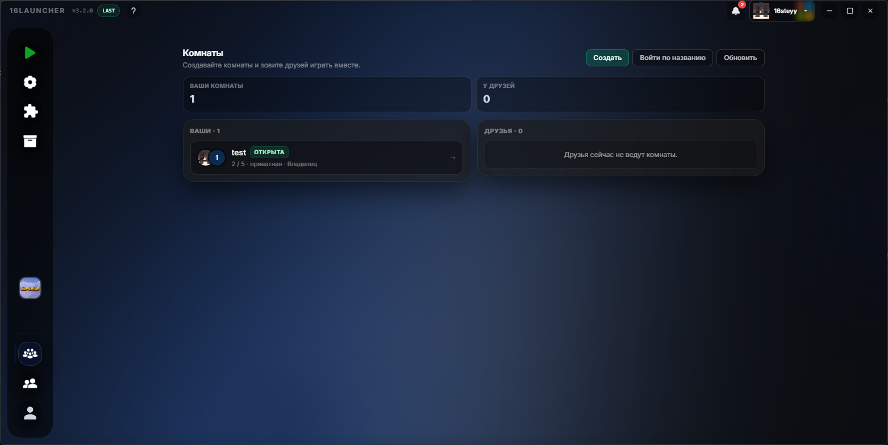

# Обновление 3.2.0

  

  

  

  

## Что нового

Добавлены приватные комнаты и улучшение вкладки "Играть"

# Добавлено

## - Приватные комнаты

- Теперь при создании комнаты, вы можете сделать ее приватной и выбрать пароль для входа. Такую комнату не будет видно в списке комнат и вход в нее будет доступен только по паролю или по приглашеению владельца.

## - Сборки в главном меню

- В главное меню было добавлено 4 слота для недавно сыграных сборок.

# Улучшено

### Вкладка комнат была улучшена и приобрела новый дизайн.

Если вы хотите поддержать проект и помочь его дальнейшему развитию, вы можете стать [нашим бустером на Boosty](https://boosty.to/16steyy)! Для бустеров предусмотрена награда в виде эксклюзивного бейджа **«Спонсор»** в лаунчере и благодарность в списках обновлений!

Нашли баг? Сообщите об этом в нашем [Discord](https://discord.gg/55Y95EfsHM) или откройте issue на [GitHub](https://github.com/launcherdev11)!
