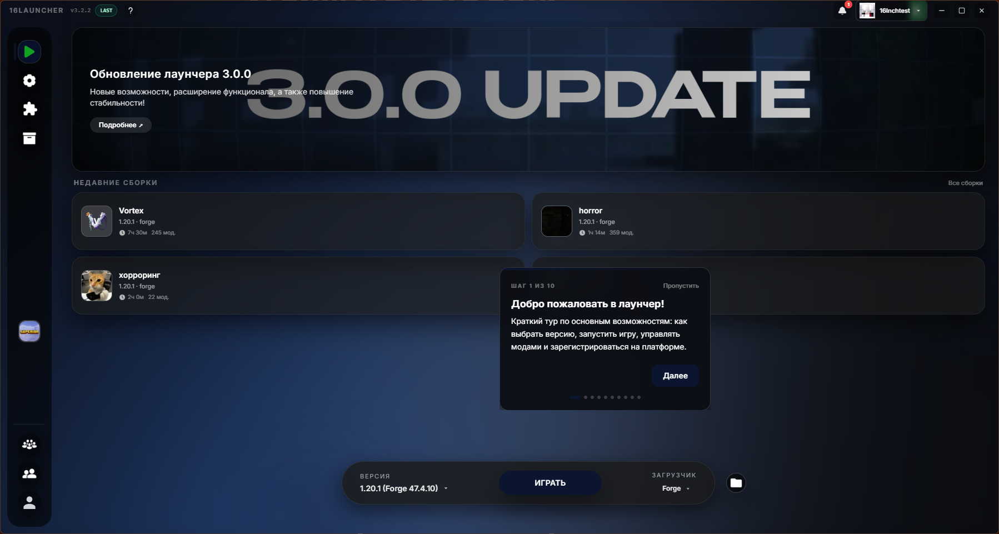
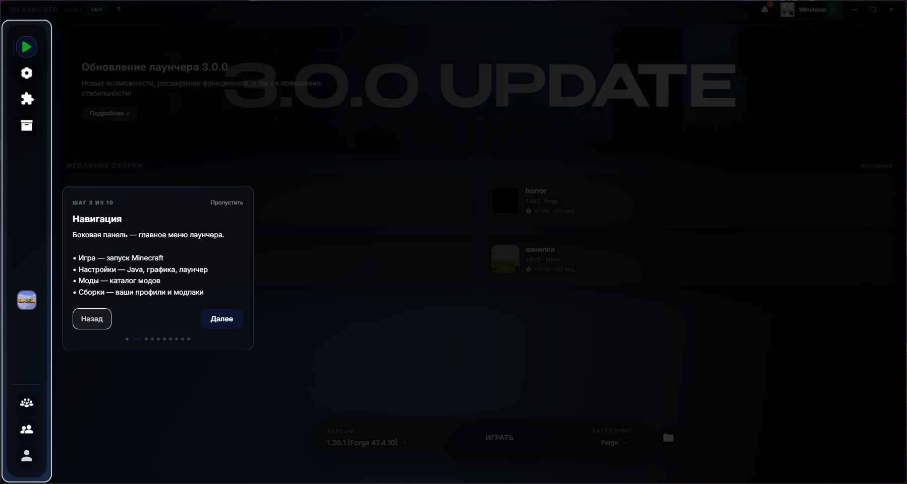
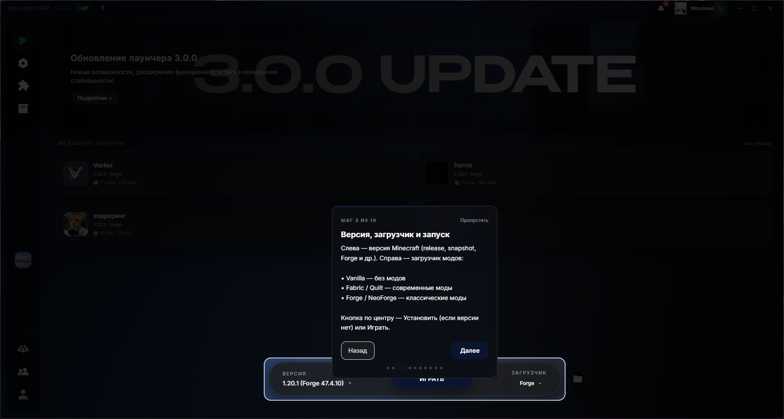
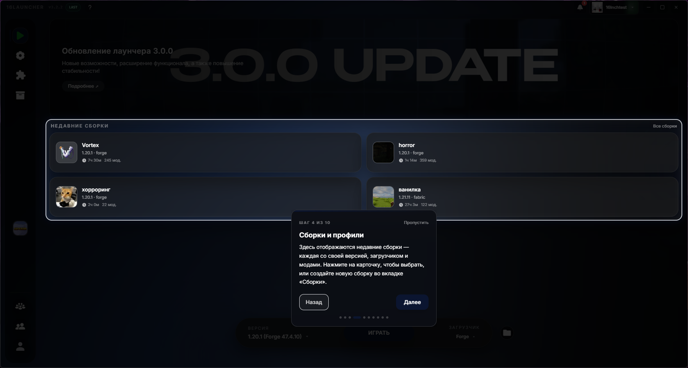
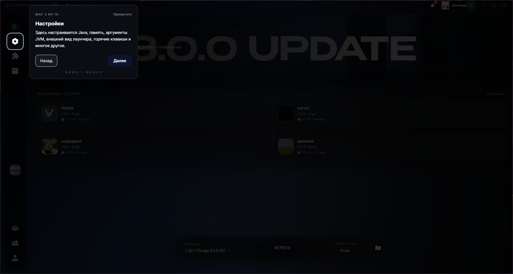
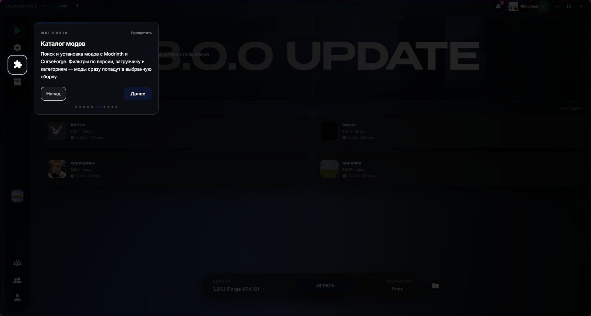
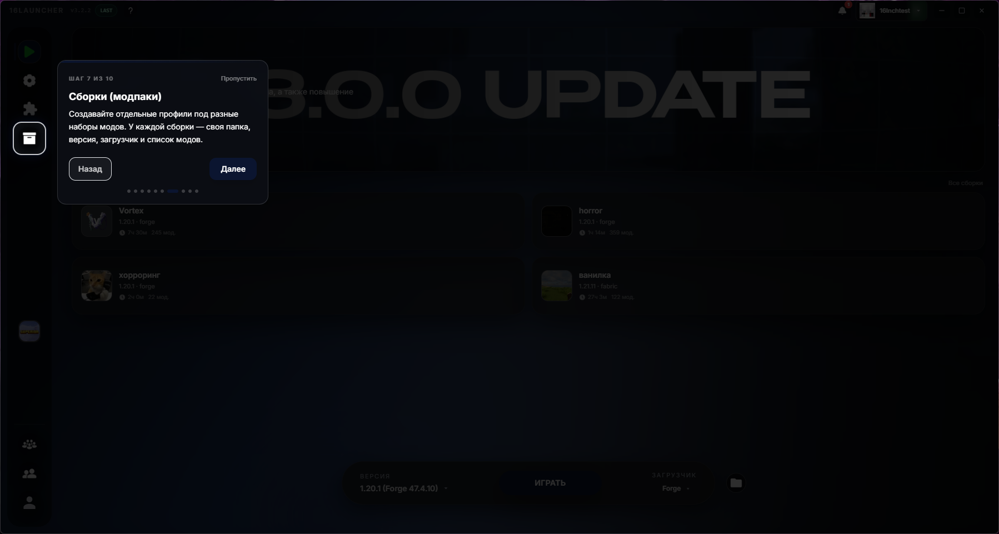
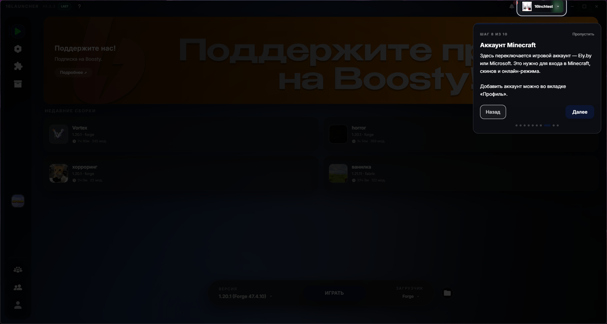
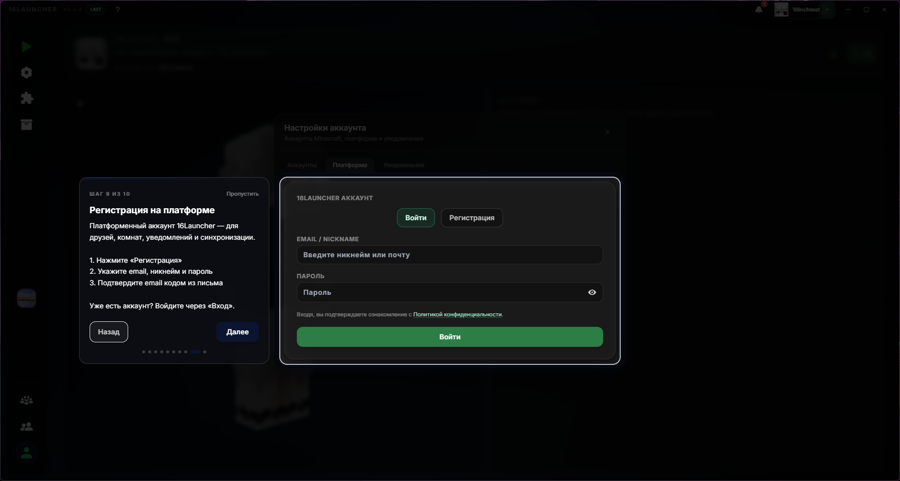
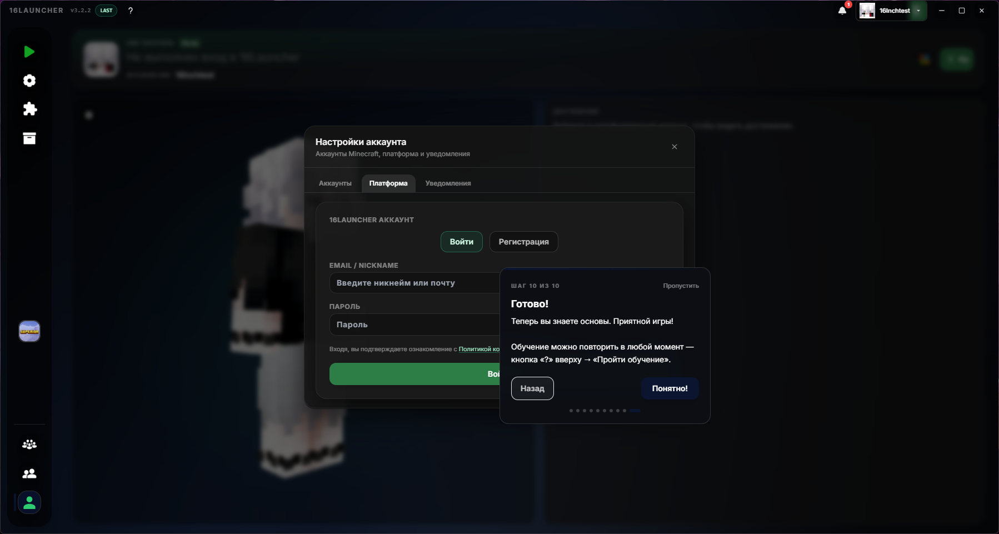

# Обновление 3.2.2

  

  

  

  

## Что нового

Добавлено обучение для новых полльзователей.

# Добавлено

## - Обучение для новых пользователей.

- Теперь для новый пользователей лаунчера появилось обучение, которое кратко поможет им освоить программу. Запустить обучние снова можно, нажав на иконку "?" в левом верхнем углу программы.

Если вы хотите поддержать проект и помочь его дальнейшему развитию, вы можете стать [нашим бустером на Boosty](https://boosty.to/16steyy)! Для бустеров предусмотрена награда в виде эксклюзивного бейджа **«Спонсор»** в лаунчере и благодарность в списках обновлений!

Нашли баг? Сообщите об этом в нашем [Discord](https://discord.gg/55Y95EfsHM) или откройте issue на [GitHub](https://github.com/launcherdev11)!