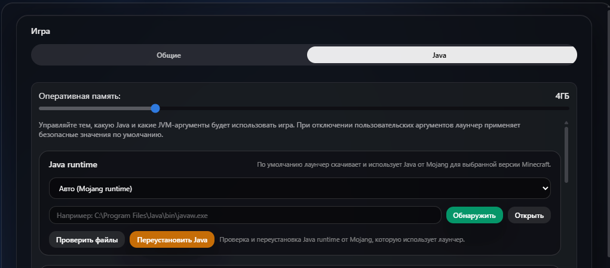

# Обновление 3.2.8

  

  

  

  

## Что нового

Исправление последних багов, расширено управление Java и настройки приватности.

## Добавлено

## - Приватность

- Добавлен новая настройка, которая позволяет выключить Discord RPC. `Настройки` - `Лаунчер` - `Показывать активность в Discord`

## - Расширение отображеня Discord RPC

- Теперь лаунчер показывает во что вы играете.

## - Свободный поиск контента

- Теперь лаунчер не выбирает версию 1.20.1 Forge базовой во вкладке модов.

## - Расширение настроек Java

- В настройки Java добавлена возможность проверить целостность её файлов и переустановить Java.

## Улучшено

- Улучшение стабильности комнат.
- Небольшое изменение вкладки аккаунтов.

# Исправлено

### - Исправлены ошибки с запуском Fabric 26.3
### - Исправлены ошибки с запуском версий 26.x

Хотим выразить благодарность за поддержку проекта нашим бустерам: Forgetich и karatelka220. Благодаря вашей финансовой поддержке проект развивается значительно быстрее и получает больше возможностей становиться лучше.

Если вы хотите поддержать проект и помочь его дальнейшему развитию, вы можете стать [нашим бустером на Boosty](https://boosty.to/16steyy)! Для бустеров предусмотрена награда в виде эксклюзивного бейджа **«Спонсор»** в лаунчере и благодарность в списках обновлений!

Нашли баг? Сообщите об этом в нашем [Discord](https://discord.gg/55Y95EfsHM) или откройте issue на [GitHub](https://github.com/launcherdev11)!
